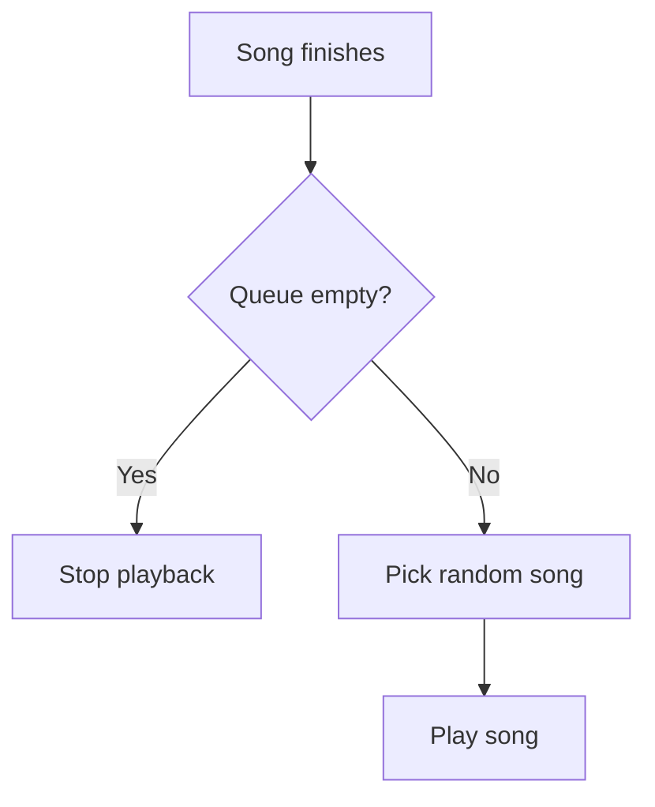

# Partify

Partify is a web application that enables collaborative party playlists powered by Spotify.  
It is similar to Spotify’s Jam feature but introduces extended functionality: hosts retain control while guests can contribute through song suggestions and voting.  

## Key Features

- Hosts create a party session and control playback.
- Guests join via link or QR code to add and vote on songs.
- Multiple queue modes: random, insertion order, or vote-based order.
- Transparent playback history, preserved after the party as a session memory.
- Multiple hosts supported, with a clear distinction between playback control and session management.

## How It Works

### Hosts

- Create a session (optionally importing an existing playlist as the starting queue).
- Start playback either:
  - Directly on the host’s device (e.g. Bluetooth speaker), or
  - Via Spotify Connect on a networked device (e.g. Sonos).
- Share a link or QR code so others can join.
- Manage the queue:
  - Remove unwanted tracks.
  - Add and vote for tracks, just like guests.
  - Skip to the next song if needed.
- Decide the queue order mode (this only affects the way the queue is presented in the UI, not how the next song is picked)
  - Random
  - Insertion order
  - By descending number of votes
- Upgrade guests to hosts if needed.
- Resume playback if another host takes over.

### Guests

- Join a session using a shared link or QR code.
- View the current queue and playback history in real time.
- Add songs by searching through the app’s Spotify API integration.
- Vote for songs (one vote per track per user, removable).
- See who added or voted for each track.

### General

- Sessions are persistent: playback history and contributions remain available after the party.
- Playback stops when the queue is empty.
- Both hosts and guests can see full playback history.
- The system manages the playback order: when a song ends, it picks by considering the songs in the queue with the highest number of upvotes, then picking randomly from that collection 

## Playback Flow

## Requirements
- Host: Spotify Premium account (required for playback control).
- Guests: Spotify account (Free or Premium) for authentication.
- Future extensions: additional identity providers may be supported.